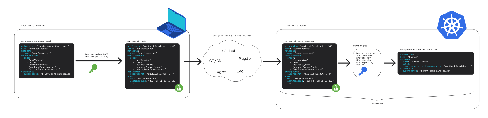

<p align="center">
  <picture height="200px">
    <source media="(prefers-color-scheme: dark)" srcset=".github/images/logo/dark.svg">
    <source media="(prefers-color-scheme: light)" srcset=".github/images/logo/classic.svg">
    
  </picture>
</p>

# Markhor 🐐

_"Bringing the security of SOPS to Kubernetes Secrets"_


Markhor is a [Kubernetes operator](https://kubernetes.io/docs/concepts/extend-kubernetes/operator/) meant to let your devs deploy [SOPS](https://github.com/getsops/sops)-encrypted Secrets inside your cluster. Lightweight, flexible and reliable.

---
**Jump to section**:
 [Intro](#intro) - 
 [Installation](#installation) - 
 [Configuring](#configuring) - 
 [MarkhorSecret Manifests](#markhorsecret-manifests) - 
 [Directory Structure](#directory-structure) -
 [Code of Conduct](#code-of-conduct) -
 [Contributing](#contributing) -
 [Versioning](#versioning) -
 [Alternatives](#alternatives) -
 [Development Roadmap](#development-roadmap)

---

# Intro

## What is this project?

This project aims to help developers managing their kubernetes Secrets. Specifically, it wants to facilitate the use of SOPS. If you do not know what SOPS is, check out [their repo](https://github.com/getsops/sops) first. We'll be here waiting 🍵

## Why should I use it?
With respect to the [alternatives](#alternatives), we are the only one that lets you:
 - use SOPS to encrypt the secrets
 - will work independently of the other tools you use (e.g., you do not need to have Helm or FluxCD)
 - ensures cryptographically the integrity of the secret
 - is lightweight
 - adopts a 'set-it-and-forget-it' approach

## Quickstart (TL;DR)

- Setup:
  1. Generate a public/private key pair
  
      e.g., `age-keygen -o my_private.key`
      
  1. Deploy Markhor on your cluster (see [installation](#installation)). Give it -and only to it- the private key.

- Usage:
  1. In your development environment, create a manifest of type `MarkhorSecret` -or use our [script](https://github.com/markhork8s/markhor/blob/main/utility_scripts/secret_to_markhorsecret.py) to convert an existing Secret automatically-. **Encrypt** it using SOPS and the public key.
      <details>
        <summary>
        Example command to encrypt a MarkhorSecret manifest using SOPS
        </summary>

        `sops encrypt --age <the_public_key>  --encrypted-regex '^(data|stringData)$' ms.yaml > ms.yaml`
      </details>

  1. Use whichever magic you want to get the `MarkhorSecret` manifest to the cluster and kubectl apply it.  

      For example, you may commit the `MarkhorSecret` to git, push to a public/private repo on GitHub and have an instance of ArgoCD from your cluster pull the new manifest and apply it, in GitOps style.

  1. Your work is done. Markhor will now automatically **decrypt** the manifest and create the corresponding `Secret` resource in the cluster. If the `MarkhorSecret` can't be decrypted, you will get an error when you kubectl apply it (if the admission hook is running. Else, you simply will not find the Secret and see the error in the Markhor pod's logs).

  1. If you modify the `MarkhorSecret`, you guessed it, the `Secret` will be updated too 🔮 (provided its decryption goes well)



# Installation

This section covers how to install Markhor in your Kubernetes cluster AND how to start using it in a project as a developer.

As of now, there is no Kustomization/Helm chart available (see the [roadmap](#development-roadmap) section), but the steps are quite easy to follow.

As for the **resource requirements**, Markhor runs in a single pod which consumes around 22MB of RAM at idle. The container image weighs around 70MB.

- For the cluster administrators (one time only):
  
  1. On a machine with kubectl access to the cluster and these programs installed:
      - kubectl
      - git
      - openssl
      - age (https://github.com/FiloSottile/age)

  1. Create a temporary directory and enter it by running `A=$(mktemp -d); cd $A`.  
     This step ensures that the private key will not be stored on disk now. But if you did not [configure K8s to store its Secrets encrypted at rest](https://kubernetes.io/docs/tasks/administer-cluster/encrypt-data/), it's of little use since the final `markhor-age-secret` containing it swill be saved on disk in clear by K8s.
  
  1. Generate a new key pair in age by running `age-keygen` (or use one you already have). Take note of the public and private key.

  1. Clone this repo by running `git clone --depth 1 https://github.com/markhork8s/markhor`

  1. Change directory into 'manifests' `cd ./markhor/manifests`

  1. Edit the file `private_key_secret.yaml` by adding your private key in the field `age_keys.txt`

  1. IF you do NOT want to use the validation admission controller (see [admission controller](#admission-controller) section):
      - Edit the `configmap.yaml` file to ensure that in `tls` the key `enabled` is set to false (if absent, the default value is false)

      - Edit the `deployment.yaml`:
        - In the `livenessProbe` and `readinessProbe` sections, remove `scheme` and the `httpHeaders` fields
        - Remove the volume mount named `markhor-tls`
        - Remove the volume named `markhor-tls`
   
      - Edit the `apply.sh` script to remove the section specific to the admission controller (see comment)
  
  1. Edit the `configmap.yaml` file to pass the desired options to the Markhor container (see section [configuring](#configuring)).
  
  1. Run the script `./apply.sh`
  
  1. Remove the temporary directory you created `cd ~; rm -r $A`
  
  1. Check that the markhor pod is up and running `kubectl get pods -n markhor --watch`

  1. Distribute the public key to the users

- For the K8s cluster users (for each project):

  1. In the project's diretory, create a `.sops.yaml` file with settings for SOPS (see [their page](https://github.com/getsops/sops) for details), similar to the following:

     ```yaml
     keys:
         # The public age key
       - &mykey age1apq7ck...8pe8y
     creation_rules:
       # Telling sops to manage all the yaml/yml files with a name ending with '_secret'
       - path_regex: '.*_secret.ya?ml'
         key_groups:
           - age:
               - *mykey
         # Telling sops to encrypt only the "data" and "stringData" fields
         encrypted_regex: ^(data|stringData)$ 
     ```
  1. Create a `MarkhorSecret` manifest and encrypt it with SOPS (e.g., by running `sops new_secret.yaml`).
  Here is an example of a file you may create. 

       Notice that, apart from the `markhorParams` field, it is exactly the manifest of the K8s Secret you'd create normally -and see section [MarkhorSecret files](#markhorsecret-files) for details on the syntax of a `MarkhorSecret` manifest-.

        ```yaml
          apiVersion: markhork8s.github.io/v1
          kind: MarkhorSecret
          metadata:
            name: my-new-awesome-app-secret
            namespace: my-new-awesome-app
          markhorParams:
            order:
              - apiVersion
              - kind
              - metadata/name
              - metadata/namespace
              - markhorParams/order
              - data/sessionSecret
          data:
            sessionSecret: aHR0cHM6Ly95b3V0dS5iZS9kUXc0dzlXZ1hjUT8=
        ```
      <details>
        <summary>
        Once encrypted with SOPS, it looks like this
        </summary>

        ```yaml
        apiVersion: markhork8s.github.io/v1
        kind: MarkhorSecret
        metadata:
            name: my-new-awesome-app-secret
            namespace: my-new-awesome-app
        markhorParams:
            order:
                - apiVersion
                - kind
                - metadata/name
                - metadata/namespace
                - markhorParams/order
                - data/sessionSecret
        data:
            sessionSecret: ENC[AES256_GCM,data:ZkWkp381nnkvozuBqHUMbyRhZelfJk69J8m/kxOuXexJKVBpbsGOBQ==,iv:YMaJm1YUgTMbV7IPccOQ5WjFPBxv1fEhibVglu426bY=,tag:EK3q6dg0iDNe7bP6fjCzIA==,type:str]
        sops:
            kms: []
            gcp_kms: []
            azure_kv: []
            hc_vault: []
            age:
                - recipient: age1apq7ck5adq6dkd0c242phl42fsurvpxvt9pwk0qg7ahdex7fqppqj8pe8y
                  enc: |
                    -----BEGIN AGE ENCRYPTED FILE-----
                    YWdlLWVuY3J5cHRpb24ub3JnL3YxCi0+IFgyNTUxOSBLOWtsNnBXNWdYL05qVXVO
                    RGJCc0VlaDVTZ0JuQyswRCtLSHJQcUZFSGdBCktMUHgzYlppSGJEL1lyeTNtY2tv
                    VExzMzBvaUNIeExjUFBwNTQrQ1VuNXMKLS0tIEVRZWd6MjhxVTNQRmhxeVVPZkhl
                    THUzS3BRQWR4OEJiVEN0ODRzTXY5ejAKkflmiuAW1b6/63tFcI49nWjIzi1RGHKA
                    NAyMjW7F2pO884j2rSCHIK1+SKItlS72QhZjC8cK4Xxm0yFPGOnjCQ==
                    -----END AGE ENCRYPTED FILE-----
            lastmodified: "2024-05-04T18:55:50Z"
            mac: ENC[AES256_GCM,data:CASz0h/fcr1TCVX334YCjI4w8/H1aDjL9qhosYlGVyalJc6XdjvfbM/lCl2y6bsZ75+O5Yh8hqVyjciJvVdIQ5UUKIJCNZkMuS9iESRFuP+Mt2qsK595In0kBoG4ZTD3YOINcNwnPFTfXzQB6Ffp8wSSTzEjIzW1uAS7U32plcM=,iv:HDxJA01ufCP4k05GZgQAQbpDlZ4xc2A4q4Lq710YFV4=,tag:SMHlmW4u400YjnnxyYf+1g==,type:str]
            pgp: []
            encrypted_regex: ^(data|stringData)$
            version: 3.8.1
  
        ```
      </details>
        
  1. Now you can commit/push this file wherever you want. Once it reaches the cluster, the Markhor pod running inside it will take care of decrypting it and creating the corresponding secret.
# Configuring

This section covers the configuration options available for the Markhor operator (the component which runs inside the K8s cluster).

It is configured exclusively through one yaml file. The default location for this file is `/etc/markhor/config.yaml`. You may specify an alternative path for such file using the `--config` argument when invoking the program.

A complete JSON-schema is available in [./docs/json_schema/markhor.json](https://github.com/markhork8s/markhor/blob/main/docs/json_schema/markhor.json).  
If you are a VSCode user, you can import it to enable automatic linting and suggestions by adding this line on the top of your `config.yaml` file -provided you have the [redhat.vscode-yaml](https://marketplace.visualstudio.com/items?itemName=redhat.vscode-yaml) extension installed-: `# yaml-language-server: $schema=https://raw.githubusercontent.com/markhork8s/markhor/main/docs/json_schema/markhor.json`.

Here is a table of the available options. The dot indicates nesting, so `a.b` means that there is a field named `b` inside a parent field named `a`.

<!-- This table was generated automatically by ./utility_scripts/json_schema_to_md_table.py using the file ./docs/json_schema/markhor.json -->
|Property name|Type|Default value|Description|
|-|-|-|-|
|kubernetes.kubeconfigPath|string|""|Path to the file containing the information necessary to connect with the kubernetes cluster (More info at https://kubernetes.io/docs/concepts/configuration/organize-cluster-access-kubeconfig/). If Markhor will run inside the cluster, leave it unspecified so it uses the default value of "".|
|kubernetes.clusterTimeoutSeconds|integer|10|The amount of time, in seconds, that Markhor should wait when connecting to the cluster before timing out.|
|healthcheck.port|integer|8000|The port number where the healthcheck endpoint should listen on|
|healthcheck.enabled|boolean|True|Wether to enable the healthcheck or not|
|admissionController.port|integer|443|The port number where the admission controller should listen on|
|admissionController.enabled|boolean|True|Wether to enable the admission controller or not|
|tls.enabled|boolean|False|If true, the healthcheck and validation admission controller will run on HTTPS. If false, they will run on HTTP. Default: `false`|
|tls.certPath|string|"/etc/markhor/tls/tls.crt"|Path (seen from inside the Markhor pod) where the TLS certificate file is stored.|
|tls.keyPath|string|"/etc/markhor/tls/tls.key"|Path (seen from inside the Markhor pod) where the TLS private key file is stored.|
|logging.level|string|"info"|The verbosity of the logs (see https://github.com/sirupsen/logrus?tab=readme-ov-file#level-logging)|
|logging.style|string|"text"|The format of the logs (as provided by slog)|
|logging.logToStdout|boolean|True|Wether to log the output of this program to stdout|
|logging.additionalLogFiles|array[string]|[]|List of files (besides stdout) where the logs of this process should be written to|
|behavior.fieldmanager.name|string|"github.com/civts/markhor"|Name of the field manager that Markhor will give to kubernetes|
|behavior.fieldmanager.forceUpdates|boolean|False|If this is inactive -default-, Markhor will not modify secrets which have another fieldmanager -e.g., the ones created by the admins or other apps-. On the contrary, if this is active, Markhor will take over the field manager -overriding existing secrets-. In any case, when the field manager mismatches, a warning is printed.|
|behavior.namespaces|array[string]|[]|List of all the namespaces where Markhor is allowed to operate in. An empty list -the default- signifies that Markhor will operate on all namespaces|
|behavior.excludedNamespaces|array[string]|[]|List of all the namespaces where Markhor is forbidden to operate in. This has higher priority than the "namespaces" field.|
|markorSecrets.hierarchySeparator.default|string|"/"|Which character (or string) is used as a marker for indentation in markhorParams>order. The dafault value is "/", meaning that the string "a/b" indicates a property that in JSON would be "a":{"b":"some-value"} while "a.b" indicates a property that in JSON would be "a.b":"some-value"|
|markorSecrets.hierarchySeparator.allowOverride|boolean|False|If false -default-, a MarkhorSecret manifest cannot override the value of the hierarchy separator defined in this configuration file -and a warning is printed if it tries to do so-.|
|markorSecrets.hierarchySeparator.warnOnOverride|boolean|True|Wether to print a warning when a MarkhorSecret manifest overrides the value of the hierarchy separator defined in this configuration file. Defaults to true|
|markorSecrets.managedLabel.default|string|"app.kubernetes.io/managed-by"|The name of the label that Markhor adds to the Secrets it manages. https://kubernetes.io/docs/concepts/overview/working-with-objects/common-labels|
|markorSecrets.managedLabel.allowOverride|boolean|False|If false -default-, a MarkhorSecret manifest cannot override the value of the custom label defined in this configuration file -and a warning is printed if it tries to do so-.|
|markorSecrets.managedLabel.warnOnOverride|boolean|True|Wether to print a warning when a MarkhorSecret manifest overrides the value of the custom label defined in this configuration file. Defaults to true|
<!-- This table was generated automatically by ./utility_scripts/json_schema_to_md_table.py using the file ./docs/json_schema/markhor.json -->

All the configuration relative to SOPS is currently done by using environment variables and mounting volumes in the pod (e.g., setting `SOPS_AGE_KEY_FILE` and mounting that file). See the [SOPS repository](https://github.com/getsops/sops) for more info.

## Admission Controller and TLS
An optional component of the Markhor program is the admission controller. The admission controller provides a validation webhook which lets Kubernetes check if a `MarkhorSecret` is valid when kubectl applying it.
We encourage you to enable this feature, especially if you use CD tools since it lets the CD tool know if the `MarkhorSecret` failed to decrypt.

Kubernetes admission hooks, however, require to be exposed over HTTPS ([reference docs](https://kubernetes.io/docs/reference/access-authn-authz/admission-controllers/)). If you perform the TLS termination outside of the markhor container, just ensure `tls.enabled` is set to false in the Markhor config (the default). Otherwise, you need to provide Markhor with the TLS certificate and key.

To generate the TLS certificate and key, you may use the script [./manifests/gen_hook_tls_secret.sh](https://github.com/markhork8s/markhor/blob/main/manifests/gen_hook_tls_secret.sh).
Then you need to ensure they are mounted in the pod, that there is a service where K8s can reach it, and that the healthchecks are configured to use HTTPS -as of now, this is the configuration in [./manifests](https://github.com/markhork8s/markhor/blob/main/manifests)-.

# MarkhorSecret Manifests

This section explains how a `MarkhorSecret` manifest is structured and what the requirements for making it decypherable are.

**Pro tip 💎**: You can convert instantly existing Secrets to MarkhorSecrets by using the script in [./utility_scripts/secret_to_markhorsecret.py](https://github.com/markhork8s/markhor/blob/main/utility_scripts/secret_to_markhorsecret.py)

## File structure

A MarkhorSecret manifest aims to look exactly the same as a Kubernetes Secret, with one exception: the field `markhorParams` -and the `kind` and `apiVersion` fields-.

```yaml
  apiVersion: markhork8s.github.io/v1
  kind: MarkhorSecret
  metadata:
    name: my-new-awesome-app-secret
    namespace: my-new-awesome-app
  markhorParams:
    order:
      - apiVersion
      - kind
      - metadata/name
      - metadata/namespace
      - markhorParams/order
      - data/sessionSecret
  data:
    sessionSecret: aHR0cHM6Ly95b3V0dS5iZS9kUXc0dzlXZ1hjUT8=
```

Why do we need that `markhorParams` field? Glad you asked. The core issue is the following: in both YAML and JSON _arrays are ordered, object properties are not_ (link to the [YAML](https://yaml.org/spec/1.2.2/#sequence) and [JSON](https://www.json.org/json-en.html) specifications). When dealing with a file encrypted by SOPS, if the properties are re-arranged, the Message Authentication Code (MAC) -which prevents alterations of the file- changes and the decryption process fails.

For Markhor, this issue manifests itself when we give an encrypted `MarkhorSecret` manifest to Kubernetes, which reorders the fields in alphabetical order.

To cope with this, we can either write the manifests with an order that gets preserved in transit (but anything which touches the manifest may change it) OR find a way to let the Markhor process running in the pod know how to reorder the file before attempting to decrypt it. The second option is the only feasible one -because the first may break anytime an implementation, say the one of K8s, changes-.

Therefore, I considered the following options:
1. Define a fixed ordering ourselves. E.g., "MakrhorSecrets shall always be written in alphabetical order". A bit stringent, but would work since, even if the file is modified in transit, the markhor program can reorder it alphabetically before decrypting it.
1. Define ordering "templates" that specify conventional orderings (e.g., `mytemplate1: [apiVersion,kind,metadata,data]`). Then you either specify the name of the ordering to use in the `MarkhorSecret` manifest or the Markhor pod tries a set of approved orderings. I am not particularly fond of tihs one because it would introduce the need to manage and sync these two entities (`MarkhorSecret`s and the ordering templates).
1. You include in each `MarkhorSecret` the order of the fields in a way that it does not get altered by intermediaries like K8s.

I decided to go with the first and last option: Each `MarkhorSecret` specifies the order of its fields, and alphabetic ordering is used as a fallback if such ordering is not present. This way, final users can choose the method they prefer.

If the ordering is specified inside the `MarkhorSecret`, it is included in `markhorParams.order` as an array -which is an ordered data structure both for YAML and JSON- of strings. The array contains an item for each field of the manifest which is not an object (including the `markhorParams` themselves). The order of the elements in the array is the same as the order of the corresponding fields in the manifest. The character `/` denotes nested properties (`a.b`=`{"a.b":"some_value"}`, `a/b`=`{"a":{"b":"some_value"}}`). If necessary, this character can be changed with any arbitrary string using the `hierarchySeparator` property.

With reference to the previous example, we could replace the separator `/` with `.` by writing:
```yaml
markhorParams:
    hierarchySeparator: '.'
    order:
      - apiVersion
      - kind
      - metadata.name
      - metadata.namespace
      - markhorParams.hierarchySeparator
      - markhorParams.order
      - data.sessionSecret
```

The markhorParams field may also have an additional property: `managedLabel`. It overrides the default managed-by label for the current `MarkhorSecret`. See `markorSecrets.managedLabel` in the [configuring section](#configuring) for more info on this.

# Directory Structure

```
Markhor
├── docs                      Documentation + JSON schema 📚
├── manifests                 K8s manifests 📄
├── pkg                       Source code   🧬
└── utility_scripts           Helpful miscellanea scripts 🛠
```
All the code is in [./pkg](./pkg), except for `main.go`.

# Code of Conduct

This project follows the [Contributor Covenant](https://www.contributor-covenant.org/) code of conduct.
You can find the details in [./CODE_OF_CONDUCT.md](https://github.com/markhork8s/markhor/blob/main/CODE_OF_CONDUCT.md)

# Contributing

If you'd like to contribute, that is great!  
You can find the details in [./CONTRIBUTING.md](https://github.com/markhork8s/markhor/blob/main/CONTRIBUTING.md)

If it is one of your first times contributing to open source projects, I strongly sugget you to take 30 minutes to read https://opensource.guide/how-to-contribute/. It is a curated series of articles that makes you aware of many little details that make great differences for both you and the maintainers of this project.

# Versioning:
This project follows [semantic versioning (v2.0)](https://semver.org).

# Alternatives

This section lists the other projects I know of that aim to help managing Kubernetes Secrets more securely.  
I include a comparison with Markhor. Choose the one you find works best for your use-case, I won't judge 😜.

If you are a maintainer of any of these projects and notice I glanced over something, let me know.
   
## Helm Secrets:
[Helm Secrets](https://github.com/jkroepke/helm-secrets), from what I saw, enables you to easily manage K8s secrets with SOPS, as long as your apps are packaged with Helm.

## FluxCD:
If you use Flux for your CD, it has built-in support for SOPS ([link](https://fluxcd.io/flux/guides/mozilla-sops/)).

## Sealed Secrets:
[Sealed Secrets](https://github.com/bitnami-labs/sealed-secrets) is a project from bitnami. From what I have seen it is very similar to Markhor, but does not use SOPS to do the encryption/decryption. Instead, it uses its own CLI utility called `kubeseal`.

## SOPS Secrets Operator:
From what I saw, the [SOPS Secrets Operator](https://github.com/isindir/sops-secrets-operator) provides essentially the same functionality of this project, but **alters the SOPS decryption function to skip the MAC check**. This means that the decryption is successful even if the encrypted file was altered, introducing a security concern.

## ArgoCD:

The support for SOPS ArgoCD appears to only be available through plugins.
Looking at these resources, the integrations seem a bit too hacky for me:
- https://blog.pelo.tech/k-markhor-argocd-54becd3a1a34
- https://community.ops.io/jilgue/secrets-in-argocd-with-sops-pa6
- https://medium.com/@CoyoteLeo/security-upgrade-with-sops-5d4a1385c680
- https://www.redhat.com/en/blog/a-guide-to-gitops-and-secret-management-with-argocd-operator-and-sops

# Development Roadmap
Here is a recap of where we are in the development of this project.

Finished features:
 - Custom Resource Definition `MarkhorSecret` ✅
 - Kubernetes operator to convert `MarkhorSecret`s into `Secret`s ✅
    - Create a `Secret` when a `MarkhorSecret` is created ✅
    - Update a `Secret` when a `MarkhorSecret` is updated ✅
    - Delete a `Secret` when a `MarkhorSecret` is deleted ✅
 - Healthcheck ✅
 - Logging with slog and different levels ✅
 - Testing ✅
 - Validation hook to let CD know of malformed `MarkhorSecret`s ✅
 - Honor all the values set in the config file ✅

TODOs (help very much appreciated 🐜):
 - Docs ❌
    - https://www.bestpractices.dev/en
    - https://goreportcard.com/
 - Video tutorial ❌
 - Streamlining the installation process with helm/kustomize
 - Horizontal scaling + high availability (redis/dragonflydb?)
 - Ensuring support for all the methods allowed by SOPS :
   - age ✅
   - pgp
   - gcp_kms
   - azure_kv
   - hc_vault
 - Metrics endpoint for prometheus _et similia_
 - Testing the K8s event handlers in the code using the mock cluster interface
